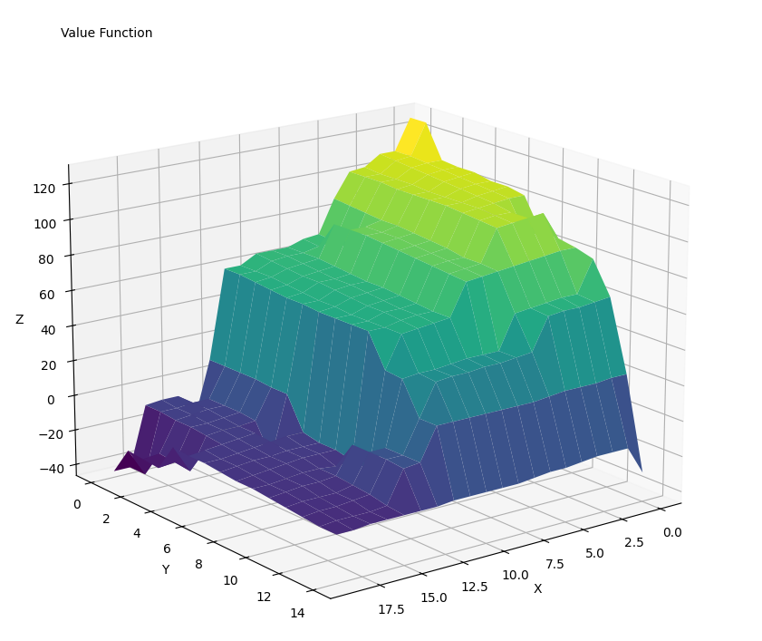
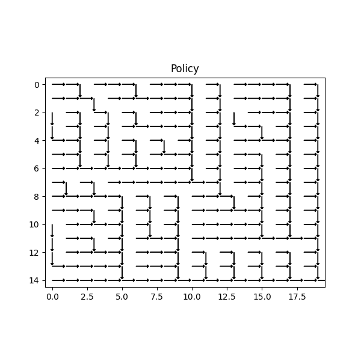

## Currently still work in progress

## Algos
#### Policy Iteration / Value Iteration / Dynamic Programming
Task: Move over a 2D grid (m*n) from upper left (0,0) to bottom right (m-1, n-1) by only moving down or right. Collect the value of each square that you land on. This is a finite, discrete and deterministic task. Your choices are either down or right, the episode always comes to an end and there is no randomness involved.

  
   

- [ ] FIX: Policy iteration doesn't seem to converge to optimal solution.

#### Monte Carlo Search 
`first_visit_mc.py`

Task: Starting at a given index in an array, jump to any position within a fixed range of your current index. Repeat a fixed number of times until the end of the episode.
Your reward for each step is drawn from a normal distribution, centred around the value of the respective index.
Unlike in the examples above, we don't know the true underlying reward of each position. For this reason we use the Monte Carlo search to average their values.

## Games
#### Tree
Tree is a simple tree that can be followed or traversed, where each node has a fixed underlying value [-1,1] where all daughter nodes values sum to 0.
However on each visit to the node the current value is drawn from a distribution centred around that value, to add some uncertainty. This means there is an optimal way to follow the tree, but it is not immediately apparent.
